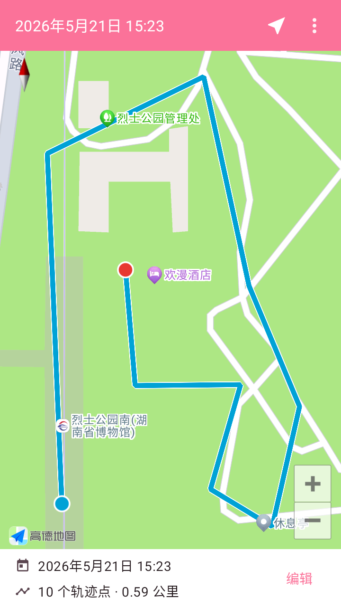
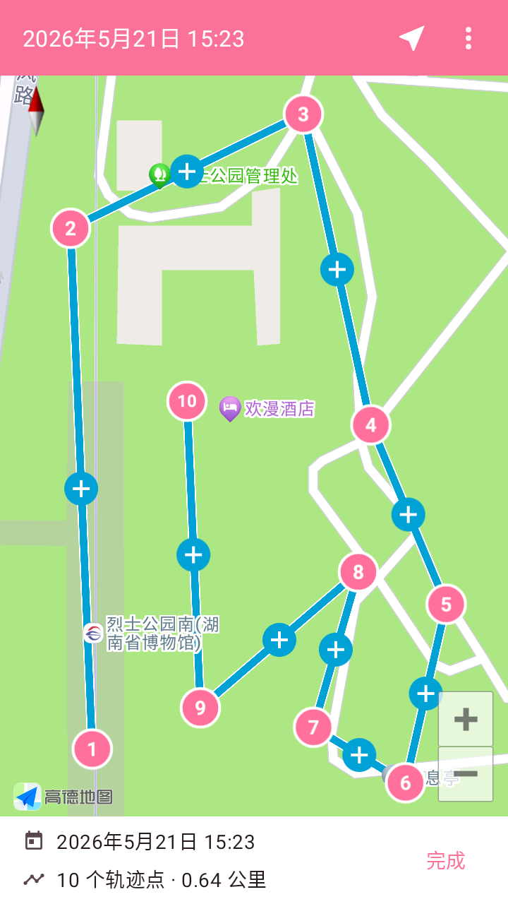
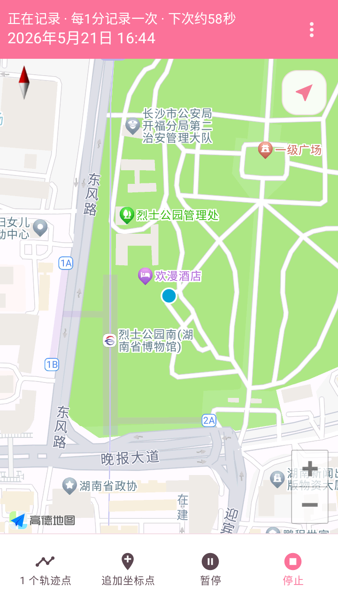

# GPX 记录器

一款面向 Android 的离线轨迹记录应用，可以在后台记录 GPS 路线，并将路线导出为 GPX 或 GeoJSON 文件。

这个版本重点面向中国国内用户做了体验优化：应用默认使用中文界面，默认地图服务切换为高德地图，并围绕国内地图坐标、定位展示、24 小时时间格式和录制中操作做了适配。

 &nbsp;&nbsp;&nbsp;  &nbsp;&nbsp;&nbsp;  &nbsp;&nbsp;&nbsp;  &nbsp;&nbsp;&nbsp; 

## 近期优化

- 默认使用中文和高德地图，更适合国内用户直接安装后使用。
- 支持高德地图轨迹点编辑，可插入、拖动、删除坐标点，并为坐标点添加备注。
- 录制中可以追加当前位置坐标点、调整记录间隔，并显示距离下一个轨迹点的倒计时。
- 默认使用 24 小时时间格式，路线详情页也可以切换时间展示方式。
- 优化录制页、路线列表、详情页和导出流程的界面风格，补充深色模式切换。
- 支持将路线导出为 GPX 或 GeoJSON，轨迹点备注会写入导出内容。

## 主要功能

- 后台持续记录 GPS 轨迹。
- 前台服务通知提供录制控制，方便暂停、继续或停止记录。
- 本地保存路线数据，不依赖云端服务。
- 路线详情页展示地图、距离、点数、开始时间和轨迹信息。
- 支持恢复已有路线继续记录。
- 支持保存或分享导出的 GPX/GeoJSON 文件。
- 支持浅色/深色主题切换。

## 技术栈

- [Realm](https://www.realm.io)：本地数据持久化。
- [Dexter](https://github.com/Karumi/Dexter)：运行时权限处理。
- [FusedLocationProvider](https://developers.google.com/android/reference/com/google/android/gms/location/FusedLocationProviderClient)：定位服务。
- [高德地图 SDK](https://lbs.amap.com/)：国内地图展示与轨迹编辑体验。
- [Apache Commons IO](https://commons.apache.org/proper/commons-io/)：文件写入。
- [RxJava](https://github.com/ReactiveX/RxJava)：异步事件处理。
- [EventBus](https://github.com/greenrobot/EventBus)：辅助 Service 与界面之间通信。

## 架构说明

### 后台记录

应用通过 `LocationRecorderService` 这个前台服务在后台记录位置。前台服务需要在运行期间常驻通知栏，这一点正好用于提供录制控制入口，例如暂停、继续、停止记录或追加当前坐标点。

`LocationRecorderService` 内部使用 Google 的 `FusedLocationProvider` 获取定位更新。启动记录时，应用会根据用户选择的记录间隔创建定位配置，然后持续接收并写入轨迹点。

### 服务控制

录制服务主要通过两种方式控制：

#### Android Intent

用户点击通知栏中的操作按钮时，系统会把对应 Intent 发送给服务。服务读取 Intent extras 后执行对应操作，例如暂停、继续或停止记录。

#### Service Binding

应用界面需要通过 Service Binding 连接正在运行的服务。连接建立后，录制页可以读取当前录制状态、记录间隔、下一个轨迹点倒计时，并调用追加坐标点或更新记录间隔等方法。

`EventBus` 用于在服务状态变化时通知界面刷新，例如新增轨迹点、暂停、继续或更新记录间隔。

### 路线存储

路线全部保存在本地 Realm 数据库中。路线数据结构由 `Route`、`Waypoint`、`Track`、`Segment` 和 `TrackPoint` 组成，适合表达 GPX 中嵌套的轨迹结构。

应用以本地数据库作为唯一数据源，路线列表、详情页和地图展示都会根据数据库内容刷新。当前支持将路线转换为 `.gpx` 或 `.geojson` 文件；暂不支持从外部 GPX/GeoJSON 文件反向导入路线。

## 发布说明

当前发布记录维护在本仓库的 GitHub Releases 页面中。
